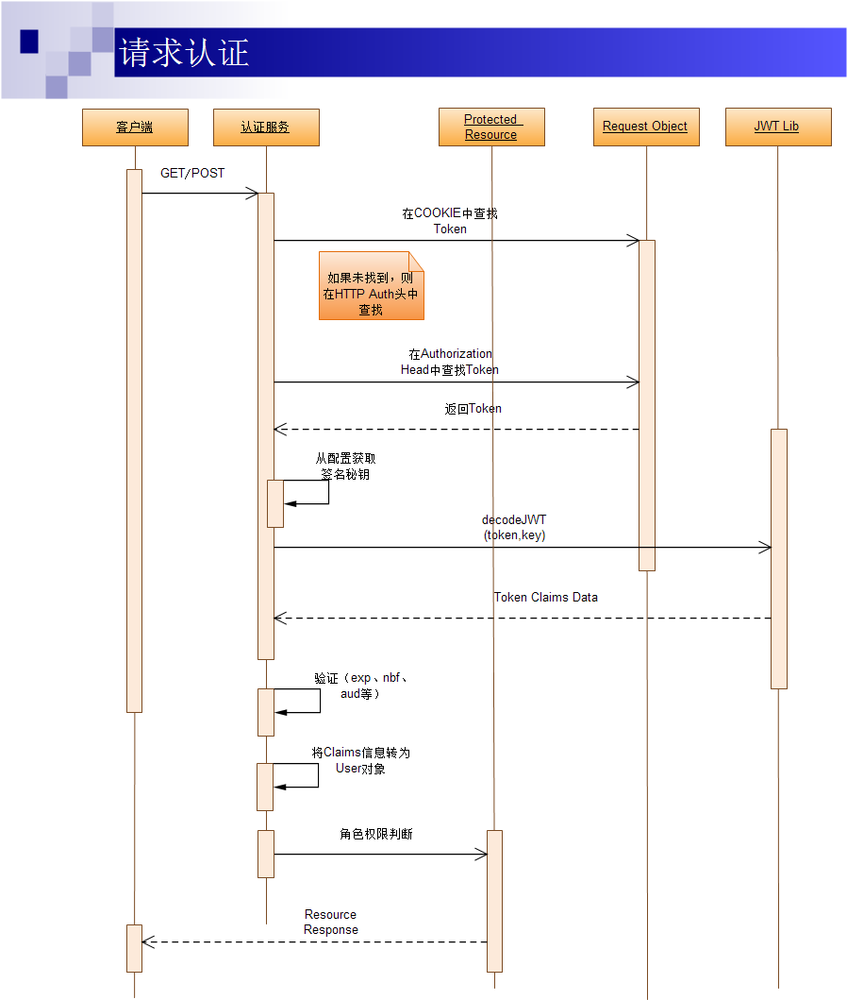

# 1. 基于Token的Web后台认证机制

## 1.1 几种常用的认证机制

### 1.1.1 HTTP Basic Auth
> 简单来说这种方式就是在每次进行API请求的时候都提供用户的`username`和`passowrd`,**但是有暴露信息的风险**

### 1.1.2 OAuth
> `开放授权`:一个开放的授权标准, 允许第三方应用访问用户存放在某一web服务器的私有的资源,**无需提供用户名和密码**,*流程如下*: 


> 不适用于**自有认证权限**的企业应用

### 1.1.3 Cookie Auth
> `Cookie`认证机制就是为一次请求认证在服务器端创建一个`Session`对象,通过用户带上来的`Cookie(携带有服务器端种下的SessionID)`与服务器端的Session匹配进行状态管理
- 这种方法安全性不高,且不能进行跨域
- 一般如何解决通过这种方式的跨域问题

### 1.1.4 Token Auth


- Token可以放在`Cookie`中
    + 可以指定`httponly`,也可以指定`security`
- 存放于`localstorage`中
    + 将token存放于`localstorage`中，但是有**XSS攻击**的风险,需要应用程序保证`token`只在`HTTPS`下传输     

<h4>一：安全的请求方式</h4>
   
> 1.在HTTP请求时，可以在form表单中加上一项`<input type="hidden" value="your token">`，提交给后台校验提交的token是否和cookie中的token一致。接受表单的同时确认`token`的有效性<br/>
2.放在`form的隐藏域`或者具有`http_only`属性的cookie字段中也是可以的

<h4>二：一般存放格式</h4>

```html
用户名：明文存放。 
登录序列：一个被MD5散列过的随机数，仅当强制用户输入口令时更新（如：用户修改了口令）。 
登录Token：一个被MD5散列过的随机数，仅一个登录Session内有效，新的登录Session会更新它。
```  

<h4>三：认证过程</h4>   

- **登录**
    + 第一次认证：第一次登录，用户从浏览器输入用户名/密码，提交后到服务器的**登录处理的Action层**（Login Action）；
    + Login Action调用认证服务进行用户名密码认证，如果认证通过，Login Action层调用用户信息服务获取用户信息（包括完整的用户信息及对应权限信息）；
    + 返回用户信息后，Login Action从配置文件中获取Token签名生成的秘钥信息，进行Token的生成；
    + 生成Token的过程中可以调用第三方的JWT Lib生成签名后的JWT数据；
    + 完成JWT数据签名后，**将其设置到COOKIE对象中**，并重定向到首页，完成登录过程；
    
    
- **请求认证**
<br/>基于token的请求认证每一次请求都会附带上`token`字段,这个Tokenx信息可能会在`cookie`中或者是 HTTP的`Authorization`中
    + 客户端（APP客户端或浏览器）通过GET或POST请求访问资源（页面或调用API）
    + 认证服务作为一个Middleware HOOK 对请求进行拦截，首先在cookie中查找Token信息，如果没有找到，则在HTTP Authorization Head中查找；
    + 如果找到Token信息，则根据配置文件中的签名加密秘钥，调用JWT Lib对Token信息进行解密和解码；
    + 完成解码并验证签名通过后，对Token中的exp、nbf、aud等信息进行验证；
    + 全部通过后，根据获取的用户的角色权限信息，进行对请求的资源的权限逻辑判断；
    + 如果权限逻辑判断通过则通过Response对象返回；否则则返回HTTP 401；
    

# 2.网页第三方注册接入

## 2.1 微博登录

- 01-首先当然要去微博开放平台申请权限了
- 02-然后在`script`中要加入**微博规定好的api**
    + 在appkey中需要加入你的微博开发者ID(在申请开发者时候平台会发放)
```js
<script src="http://tjs.sjs.sinajs.cn/open/api/js/wb.js?appkey=*******&debug=true" type="text/javascript" charset="utf-8">
</script>
```
- 03-在微博登录按钮上加入`wb_connect_btn`(可以自己修改自定义)
```html
    <span id="wb_connect_btn">微博登录按钮</span>
```
- 04-然后就是JS代码中的相关配置
```js
<script>
    WB2.anyWhere(function (W) {
        W.widget.connectButton({
            id: "wb_connect_btn",
            type: '3,2',
            callback: {
                login: function (o) { //登录后的回调函数
　　　　　　　　　　　 console.log(o); //o 返回用户的信息
                    try{
                        document.getElementsByClassName('loginout')[0].click();
　　　　　　　　　　　　　　　//页面需求，当前页面登录完成之后，不进行跳转，所以模拟点击事件，让微博账号在当前域中退出。不影响下次登录。（元素为微博动态添加）
　　　　　　　　　　　　　　　//微博没有提供退出方法。下面的logout为另一种开发模式调用。

                    }catch(e){
                        console.log(e);
                    }
                },
                logout: function () { //退出后的回调函数
                    
                }
            }
        });
    });
</script>    
```
## 2.2 QQ登录
- 01-首先还是要申请开发权限的
    + `data-appid`中填入qq开发平台发放的appId 
```js
<script type="text/javascript" src="http://qzonestyle.gtimg.cn/qzone/openapi/qc_loader.js" data-appid="******" charset="utf-8">
</script>
```
- 02-同样加入qq样式(也可以自定义)
```html
<span id="qqLoginBtn"></span>
```
- 03-接下来就是JS中的配置以及回调函数
```js
QC.Login({
        //btnId：插入按钮的节点id，必选
        btnId:"qqLoginBtn",
        //用户需要确认的scope授权项，可选，默认all
        scope:"all",
        //按钮尺寸，可用值[A_XL| A_L| A_M| A_S|  B_M| B_S| C_S]，可选，默认B_S
        size: "B_S"
    }, function(reqData, opts){//登录成功
        //根据返回数据，更换按钮显示状态方法
        console.log(reqData);//查看返回数据
        QC.Login.getMe(function(openId, accessToken){//获取用户的openId
            console.log('QQOPENID:'+openId);
            thirdparty(null,null,reqData.figureurl_qq_2,reqData.nickname,1,openId);
            QC.Login.signOut();//退出QQ登录调用事件
        });
    }
);    
```

## 2.3 微信登录
- 01-首先要在微信开发者平台注册获取**appid**
- 02-放置微信登录图标
    + `<span id="weixin-login"></span>`
- 03-然后js代码中第一步请求`CODE`
```js
$('.weixin-login').on('click',function(){
    window.location.href='https://open.weixin.qq.com/connect/qrconnect?' +
    'appid=*******&redirect_uri=http%3a%2f%2fwww.xxxxxx.com%2f'
+window.location.pathname.substr(1)+'&response_type=code&scope=snsapi_login&state=3d6be0a4035d839573b04816624a415e#wechat_redirect';
});
```

> redirect_url: 要想传入当前的url,直接`encodeURIComponent(window.location.href)`  <br/>
填入的redirect地址必须为**审核时填写的授权域名**,不然链接无法访问

- 04-用户点击后会出现如下界面


- 05-在用户同意授权的情况下可以截取到url地址中的`CODE`参数,需要拿着这个参数去和微信换取下一个令牌,**由于涉及跨域,微信又不允许跨域,只能通过后台发起请求**
    + 第二步，后台请求：`https://api.weixin.qq.com/sns/oauth2/access_token?
    appid=[APPID]&secret=[SECRET]&code=[CODE]&grant_type=authorization_code`
替换中括号中的数据 。


- 06-然后返回参数
```js
{ 
    "access_token":"ACCESS_TOKEN", 
    "expires_in":7200, 
    "refresh_token":"REFRESH_TOKEN",
    "openid":"OPENID", 
    "scope":"SCOPE",
    "unionid": "o6_bmasdasdsad6_2sgVt7hMZOPfL"
}
```
- 07-最后！！！通过以上参数中的'access_token'和`openid`再发起一次请求
    + `https://api.weixin.qq.com/sns/userinfo?access_token=[ACCESS_TOKEN]&openid=[OPENID]`

# 3. 实现网页端分享功能
## 3.1 微博分享
- 只需要链接上`http://v.t.sina.com.cn/share/share.php?title=xxx&url=xxx`就可以跳转到微博分享页面

